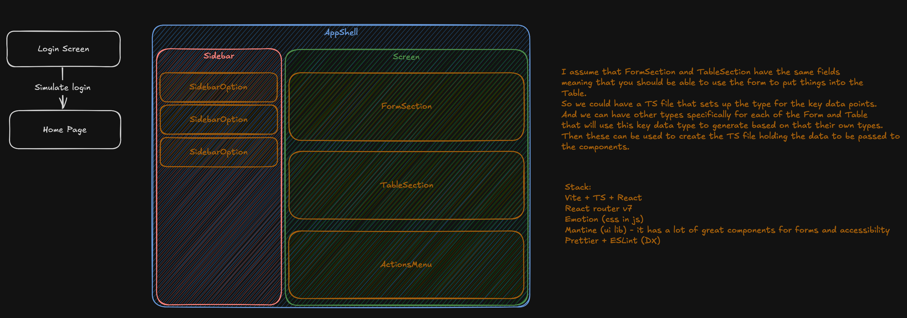

# Web App Platform

This is a simple web app platform with screens that each has a form, table and actions.

## Technologies & Tools

- React
- TypeScript
- Vite
- Mantine
- React Router v7
- Emotion
- Eslint
- Prettier

## Features

### 🔐 Mock Authentication and Authorization

The app has a fake login screen that doesn't actually verify anything (no backend).\
To log in you only need to enter valid email and password according to the validation logic of the form.\
It uses the session srotage to store a hardcoded fake token.
This logic is abstracted away in a `useAuth` hook.

### 📱 Responsive Layout

The app has a responsive layout.

### 🖼️ Generic Screen Components & Router

The app has a generic screen component that can be used to create new screens.\
Each screen has a form, table and actions.\
Everything is strongly typed and easy to extend.

## How to run locally?

```bash
git clone https://github.com/Diego-Mc/web-app-platform.git

cd web-app-platform

npm install

npm run dev
```

## Thinking process

I started with some sketches about the technical design of the app:



Later I began researching a few libraries and frameworks that could help me build the app quickly and efficiently.

### UI Library

I chose Mantine because it has a lot of components especially for forms, I almost went with Radix but Mantine won because they had more form related components.

### Router

I chose React Router v7 in its library form because it is a simple and reliable library for SPA routing.

### CSS-in-JS

I chose Emotion because it is simple and popular.

### DX

I chose Vite because it is fast and easy to use. I also added eslint and prettier to improve consistency and readability.
